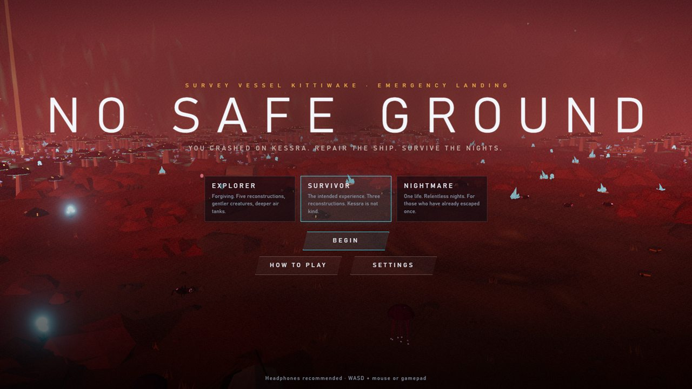
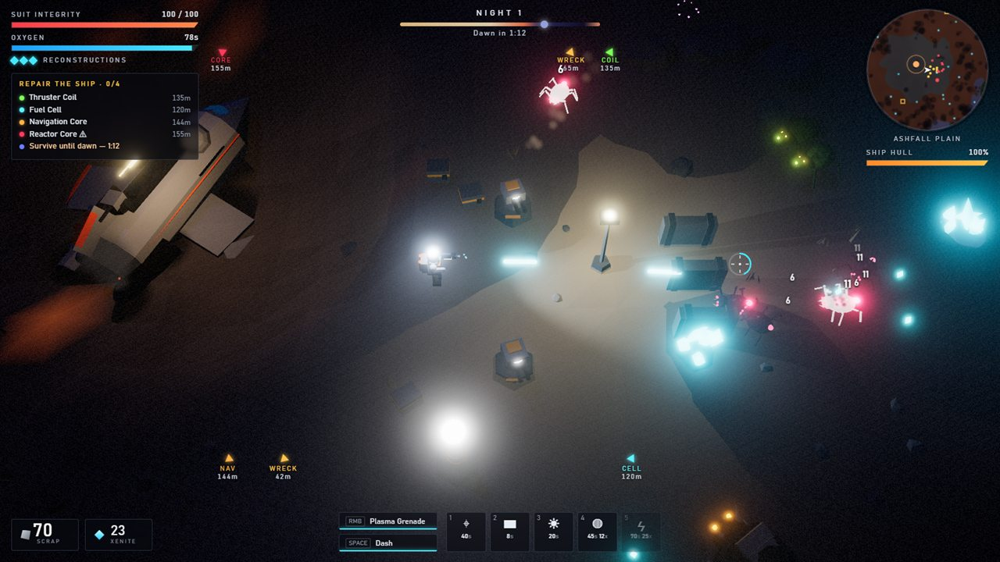
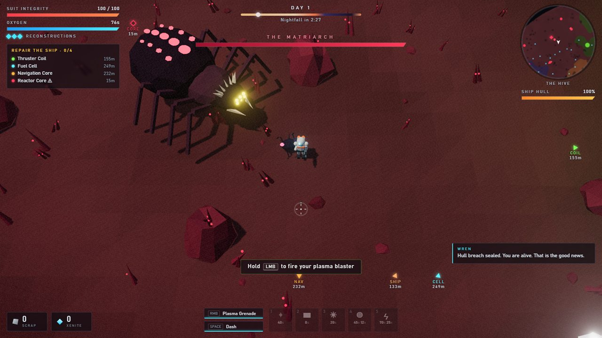
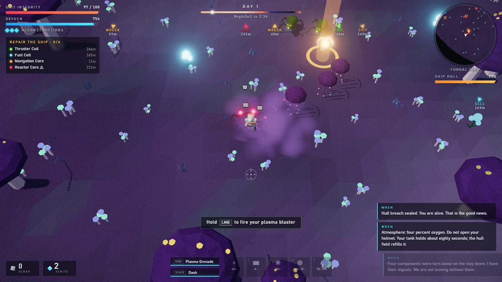
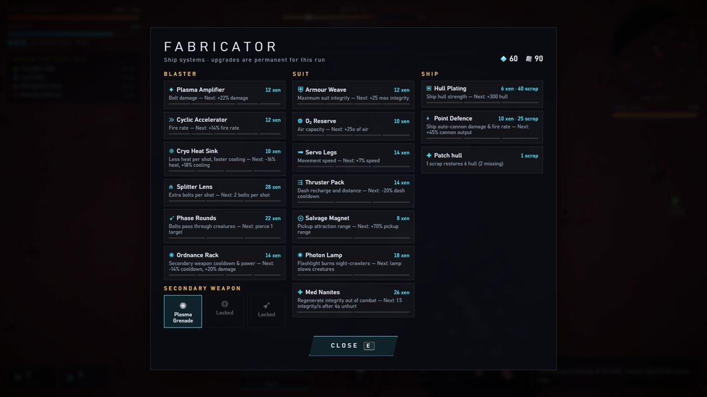

# NO SAFE GROUND

> Crash-landed on Kessra. Four missing ship parts. Eighty seconds of air. The nights are worse.

A top-down 3D survival shooter for the browser. You are the only survivor of the ISV *Kittiwake*, which has crash-landed on a poisonous alien world. Your ship AI, WREN, can get you home. First you need to recover the four components torn off in the crash, keep the wreck standing through each night, and hold out through a 75-second launch.



## How a run plays out

- **Explore by day.** Four signals lead into four hostile biomes:

  | Part | Biome |
  | --- | --- |
  | Thruster Coil | Acid Marsh |
  | Fuel Cell | Crystal Barrens |
  | Navigation Core | Fungal Deep |
  | Reactor Core | The Hive, guarded by **the Matriarch** |

- **Watch your air.** Your suit holds about 80 seconds of oxygen. The ship's field and any O₂ Beacons you build refill it, and so do blue air bulbs in the wild. If it runs out, you suffocate.
- **Salvage.** Loot wrecks and shoot ore and xenite crystals. Scrap pays for defences and xenite pays for upgrades. Survey logs from a lost expedition give you tips and unlock blueprints.
- **Survive the night.** At dusk the swarm comes for the ship: skitters, acid spitters, charging rams, burrowers and spore drifters. Each night is worse than the last. Build turrets, barricades, flood lamps, O₂ beacons and tesla coils, and stay in the light.
- **Upgrade.** Press **E** at the ship's hatch to open the fabricator. It offers 15 upgrades across blaster, suit and ship, plus repairs and a choice of secondary weapon: Plasma Grenade, Arc Nova or Seeker Swarm.
- **Escape.** Install all four parts to start the launch sequence. Hold the ship against everything Kessra has left, then get aboard before it lifts off.

If you die, any part you were carrying drops where you fell, and your suit is rebuilt at the ship, which costs one reconstruction. The run ends when you have none left or the ship's hull breaks.

| | |
| --- | --- |
|  |  |
|  |  |

## Controls

| Action | Keyboard / mouse | Gamepad |
| --- | --- | --- |
| Move | WASD / arrow keys | Left stick |
| Aim | Mouse | Right stick |
| Fire plasma blaster (watch the heat) | Hold left mouse button | RT |
| Secondary weapon | Right mouse button | LT / RB |
| Dash (brief invulnerability) | Space / Shift | A / LB |
| Interact / fabricator | E / F | X |
| Build: turret, barricade, lamp, beacon, tesla | 1 – 5, then left-click to place | D-pad ↑ → ↓ ←, Y (tesla), then RT |
| Cancel placement | Right-click / Q / Esc | B |
| Map | M / Tab | View |
| Pause | Esc / P | Menu |
| Zoom | Mouse wheel | |
| Skip cutscene | Space / Enter / click | A |

Menus use the mouse.

## Difficulty

| | Reconstructions | Notes |
| --- | --- | --- |
| **Explorer** | 5 | Gentler creatures, deeper air tanks, more salvage |
| **Survivor** | 3 | The intended experience |
| **Nightmare** | 1 | Tougher, harder-hitting creatures and relentless nights |

Settings (volume, graphics quality, screen shake, damage numbers and hints) and your best runs are saved in the browser.

## Running it

You need Node.js 20.19+ or 22.12+.

```sh
npm install
npm run dev        # http://localhost:5317
```

```sh
npm run build      # type-checks, then writes dist/index.html
```

The production build is **one self-contained HTML file**, with no asset files and no server needed. You can double-click `dist/index.html` or put it on any static host.

A WebGL2-capable browser is required. If frame rate is low, set *Graphics quality* to Medium or Low in Settings.

## Under the hood

- **TypeScript + Three.js**, bundled by Vite into a single file with `vite-plugin-singlefile`.
- **No asset files.** Every model is built from procedural low-poly geometry merged into vertex-coloured meshes. All sound effects and the adaptive music are synthesised at runtime with the Web Audio API. The music has separate title, explore, dusk, night, boss, launch, victory and game-over moods, which crossfade and build in intensity with the threat.
- **Procedural world.** Seeded terrain with six biomes, a crash-scorched landing site, wrecks, acid pools, geysers, spore fields and ion storms.
- **Creatures** are GPU-instanced. Leg gaits and pulsing bioluminescence are animated in the vertex shader. Pathfinding uses flow fields that route around rocks and your barricades.
- **A director** spends a threat budget on daytime patrols, escalating night sieges, the boss encounter and launch waves.

```
src/
  game.ts          game states, intro/outro, interactions, audio mix
  config.ts        balance and tuning constants
  story.ts         WREN's lines and the survey logs
  audio/           procedural SFX, music and DSP
  entities/        player, enemies and boss AI, projectiles, structures, ship, pickups
  systems/         director, day/night cycle, hazards, upgrades, effects
  world/           terrain, biomes, world generation, collision
  render/          renderer, camera, sky, materials, procedural models, particles
  ui/              HUD, minimap, messages, menus and screens
```

`audio-lab.html` (open it from the dev server at `/audio-lab.html`) is a small page for auditioning every sound effect and music mood.

## Testing

`scripts/smoke.mjs` drives the game in headless Microsoft Edge through `playwright-core`, using SwiftShader. It steps the simulation, runs scripted scenarios, and saves screenshots to `screenshots/`. It prints any console errors and exits non-zero if there were any.

```sh
npm run dev                                  # in one terminal
node scripts/smoke.mjs basic night boss      # in another
```

Scenarios: `title`, `intro`, `basic`, `biomes`, `night`, `boss`, `ui`, `finale` (full ending: parts → Matriarch → launch → victory), `gameover`, `regress` (PASS/FAIL checks for past bugs: dropped parts, restart flows, pause and settings, colliders, objective markers overlapping the HUD), `launchdef` (hull lost during the launch, with and without defences), `hero` (a staged night siege for screenshots) and `soak`. To test the production build, set `URL=file:///…/dist/index.html`.
