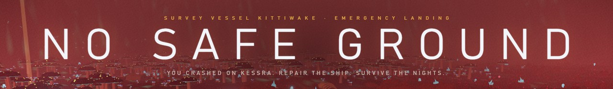
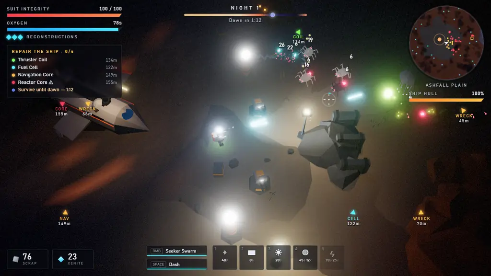
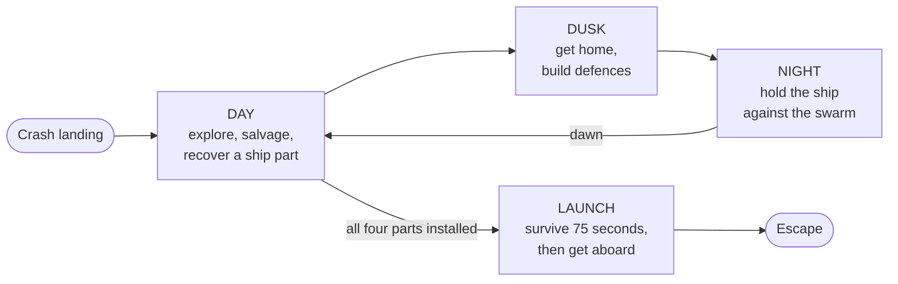
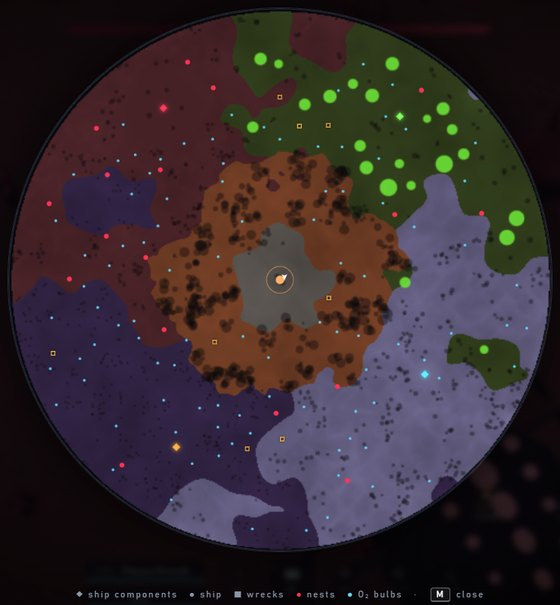
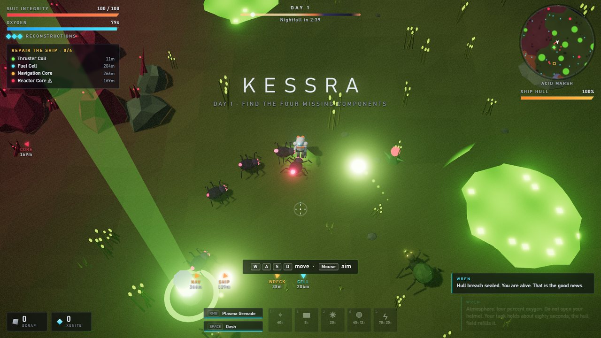
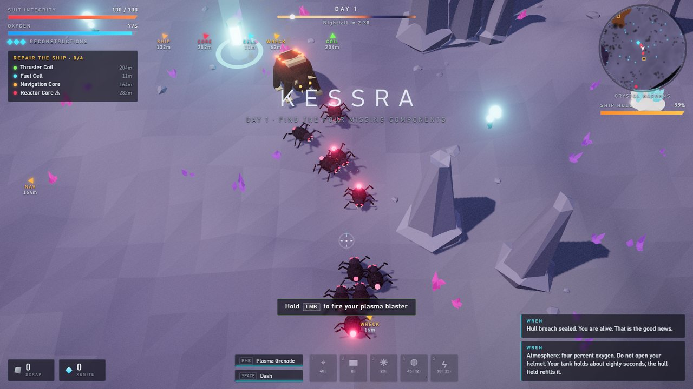

<div align="center">



### Crash-landed on Kessra. Four missing ship parts. Eighty seconds of air. The nights are worse.

A top-down 3D survival shooter that runs in your browser. Explore a poisonous alien world by day,<br>
hold your wrecked ship against the swarm by night, and get off this rock alive.

<a href="https://sambetts.github.io/no-safe-ground/"></a>

[](https://github.com/sambetts/no-safe-ground/actions/workflows/pages.yml)
[](https://www.typescriptlang.org/)
[](https://threejs.org/)
[](https://vite.dev/)




<sub>Night one at the crash site: sentry turrets, flood lamps, tesla coils, a split-shot blaster and a Seeker Swarm.</sub>

**[Play](https://sambetts.github.io/no-safe-ground/)** · [How it plays](#how-a-run-plays-out) · [The world](#the-world) · [Bestiary](#bestiary) · [Controls](#controls) · [Run it locally](#run-it-locally) · [Under the hood](#under-the-hood)

</div>

## The pitch

You are the only survivor of the ISV *Kittiwake*, brought down on **Kessra**, a poisonous world whose storms seem to pull ships out of the sky. The air is four percent oxygen and your suit holds about eighty seconds of it. The wildlife keeps its distance in daylight. It is waiting for dark.

Your ship AI, **WREN**, can fly you home. First you need the four components that were torn loose on the way down. They are scattered across four hostile biomes, and one of them lies in the nest of something enormous.

> *"Hull breach sealed. You are alive. That is the good news."*
> — WREN

Every run is a freshly generated world. It plays with keyboard and mouse or a gamepad, and the soundtrack is synthesised live and follows the danger, so headphones are recommended.

## How a run plays out



- **Explore by day.** Four signals lead into four hostile biomes. Each one hides a part WREN needs, and the signal draws attention while you carry the part home.
- **Watch your air.** Your tank refills inside the ship's field, near O₂ Beacons you build, and from blue air bulbs in the wild. Let it run dry and you suffocate.
- **Salvage.** Loot wrecks and shoot ore and xenite crystals. Scrap pays for defences and xenite pays for upgrades. Survey logs left by a lost expedition give you tips and unlock weapon blueprints.
- **Survive the night.** At dusk the swarm comes for the ship, and each night is worse than the last. Build turrets, barricades, flood lamps, O₂ beacons and tesla coils, and stay in the light.
- **Upgrade.** Press **E** at the ship's hatch to open the fabricator. It has 15 upgrades for your blaster, suit and ship, hull repairs, and a choice of secondary weapon.
- **Escape.** Install all four parts to start the launch sequence. Hold the ship for 75 seconds against everything Kessra has left, then get aboard before it lifts off.

If you die, any part you were carrying drops where you fell, and WREN rebuilds you at the ship at the cost of one reconstruction. The run ends when you run out of reconstructions or the hull breaks.

## The world

Kessra has six biomes, spreading out from the crash site:

<table>
<tr>
<td width="56%">

- **Ashfall Plain**: the crash site, with your ship, its air field and the fabricator
- **Rust Flats**: rocks, ore, wrecks and erupting geysers
- **Acid Marsh**: acid pools, nests and the **Thruster Coil**
- **Crystal Barrens**: crystal spires, geysers, the richest xenite and the **Fuel Cell**
- **Fungal Deep**: giant glowing mushrooms and the **Navigation Core**
- **The Hive**: nests everywhere, and the **Reactor Core**, guarded by **the Matriarch**

</td>
<td width="44%"></td>
</tr>
</table>

The ground is dangerous too. Acid pools burn. Geysers rumble and ring the ground a moment before they erupt, and the blast hurts creatures as well as you. Drifters burst into choking spore clouds. Ion storms roll in with lightning strikes, each marked on the ground a moment before it lands.

## Bestiary

| Creature | What it does | How to survive it |
| --- | --- | --- |
| **Skitter** | A fast, fragile pack hunter that always comes in numbers | Light slows and burns them. Don't get surrounded. |
| **Acid Spitter** | Lobs acid from range at you or at the hull | The ground glows where the acid will land, so move. |
| **Ram** | An armoured brute that charges in a straight line and tramples smaller creatures | Put a rock or barricade in its path. It staggers on impact and takes extra damage. |
| **Burrower** | Travels under the sand and erupts beneath its prey | The ground shivers, then a ring appears. Dash out of the ring. |
| **Spore Drifter** | Drifts in close and bursts into a spore cloud | Shoot it from range. Its spores hurt other creatures too. |
| **Nest** | A pulsing hive growth that keeps spawning skitters, faster at night | Destroy it for a big payout of xenite and scrap. |
| **The Matriarch** | The Hive's queen. She fires acid volleys, summons her brood, charges and strikes from below. She enrages at half health. | Bait her charge into the stone pillars. If you flee the arena, she returns to her lair and heals. |

## Defences

Press **1–5** to choose a structure, then click to place it anywhere within 11 m of you.

| Key | Structure | Cost | What it does |
| :-: | --- | --- | --- |
| 1 | **Sentry Turret** | 40 scrap | Auto-targets creatures within 15 m |
| 2 | **Barricade** | 8 scrap | Blocks the swarm. Creatures path around it, and rams stagger into it |
| 3 | **Flood Lamp** | 20 scrap | Floods 11 m with light. Night-crawlers slow down and burn in it |
| 4 | **O₂ Beacon** | 45 scrap, 12 xenite | A 7 m breathable air field for forward outposts. You can build up to 4 |
| 5 | **Tesla Coil** | 70 scrap, 25 xenite | Arcs lightning through up to 4 creatures at once |

The ship fights back with a point-defence auto-cannon, and it repairs its own hull during the day.

## The fabricator

Spend xenite at the ship's hatch, and scrap for ship upgrades and hull repairs. Fifteen upgrades across three racks:

| Rack | Upgrades |
| --- | --- |
| **Blaster** | Plasma Amplifier (damage) · Cyclic Accelerator (fire rate) · Cryo Heat Sink (less heat, faster cooling) · Splitter Lens (extra bolts per shot) · Phase Rounds (bolts pierce creatures) · Ordnance Rack (secondary cooldown and power) |
| **Suit** | Armour Weave (max integrity) · O₂ Reserve (air capacity) · Servo Legs (movement speed) · Thruster Pack (dash recharge) · Salvage Magnet (pickup range) · Photon Lamp (your lamp slows and burns creatures) · Med Nanites (regenerate out of combat) |
| **Ship** | Hull Plating (hull strength) · Point Defence (auto-cannon output) |

Your secondary weapon fires with the right mouse button. You start with the **Plasma Grenade**, a lobbed charge that blasts everything at the cursor. Two more are blueprints hidden in the survey logs:

- **Arc Nova** is a shockwave around you that stuns creatures and hurls them back.
- **Seeker Swarm** launches six micro-missiles that hunt the nearest creatures.

## Gallery

<table>
  <tr>
    <td width="50%"><p align="center"><sub><b>Night siege.</b> Turrets, lamps and barricades hold the line.</sub></p></td>
    <td width="50%"><p align="center"><sub><b>The Matriarch</b> guards the Reactor Core.</sub></p></td>
  </tr>
  <tr>
    <td width="50%"><p align="center"><sub><b>Acid Marsh.</b> Day one, and the skitters have found you.</sub></p></td>
    <td width="50%"><p align="center"><sub><b>Crystal Barrens.</b> A skitter pack closes in.</sub></p></td>
  </tr>
  <tr>
    <td width="50%"><p align="center"><sub><b>Fungal Deep.</b> The Navigation Core is in here somewhere.</sub></p></td>
    <td width="50%"><p align="center"><sub><b>The fabricator.</b> Turn xenite into firepower.</sub></p></td>
  </tr>
</table>

## Controls

| Action | Keyboard / mouse | Gamepad |
| --- | --- | --- |
| Move | WASD / arrow keys | Left stick |
| Aim | Mouse | Right stick |
| Fire plasma blaster (watch the heat) | Hold left mouse button | RT |
| Secondary weapon | Right mouse button | LT / RB |
| Dash (brief invulnerability) | Space / Shift | A / LB |
| Interact / fabricator | E / F | X |
| Build: turret, barricade, lamp, beacon, tesla | 1 – 5, then left-click to place | D-pad ↑ → ↓ ←, Y (tesla), then RT |
| Cancel placement | Right-click / Q / Esc | B |
| Map | M / Tab | View |
| Pause | Esc / P | Menu |
| Zoom | Mouse wheel | |
| Skip cutscene | Space / Enter / click | A |

Menus use the mouse.

## Difficulty

| | Reconstructions | Creature health | Creature damage | Air use | Swarm size | Salvage |
| --- | :-: | :-: | :-: | :-: | :-: | :-: |
| **Explorer** | 5 | 80% | 60% | 75% | 70% | 125% |
| **Survivor** (the intended experience) | 3 | 100% | 100% | 100% | 100% | 100% |
| **Nightmare** | 1 | 130% | 135% | 120% | 145% | 90% |

Your settings (volume, graphics quality, screen shake, damage numbers and hints) and your best runs are saved in the browser.

<details>
<summary><b>Survival tips</b> (mild spoilers from the survey logs)</summary>

<br>

- Stay in the light. Flood lamps slow and burn night-crawlers, and so does an upgraded suit lamp.
- Shoot xenite crystals to harvest them. Xenite buys upgrades.
- Rams can't turn mid-charge. Put a rock or barricade between you and them, then punish the stagger.
- Blue bulbs are full of oxygen. Walk into one and you get half a tank back.
- You're untouchable mid-dash. Use the dash to escape burrower rings and incoming acid.
- Lure the swarm over geysers, because the eruptions hurt creatures too.
- Build O₂ beacons to set up forward outposts on the way to distant parts.
- Every night is worse than the last. Don't linger.

</details>

## Run it locally

You need Node.js 20.19+ or 22.12+.

```sh
npm install
npm run dev        # http://localhost:5317
```

```sh
npm run build      # type-checks, then writes dist/index.html
```

The production build is **one self-contained HTML file** of about 840 KB, or 230 KB gzipped. It has no asset files and needs no server, so you can double-click `dist/index.html` or put it on any static host. Every push to `main` builds the game and deploys it to GitHub Pages with [`.github/workflows/pages.yml`](.github/workflows/pages.yml).

The game needs a browser with WebGL2. If the frame rate is low, set *Graphics quality* to Medium or Low in Settings.

## Under the hood

- **TypeScript and Three.js**, about 12,000 lines of TypeScript, bundled by Vite into a single file with `vite-plugin-singlefile`.
- **No asset files.** Every model is built from procedural low-poly geometry merged into vertex-coloured meshes. All sound effects and the adaptive music are synthesised at runtime with the Web Audio API. The music has separate title, explore, dusk, night, boss, launch, victory and game-over moods, which crossfade and build in intensity with the threat.
- **Procedural world.** Seeded terrain with six biomes, a crash-scorched landing site, wrecks, nests, acid pools and geysers, generated fresh for every run. Ion storms roll across it.
- **Creatures** are GPU-instanced. Their leg gaits and pulsing bioluminescence are animated in the vertex shader. They find their way with flow fields that route around rocks and your barricades.
- **A director** spends a threat budget on daytime patrols, escalating night sieges, the boss encounter and launch waves.

```
src/
  game.ts          game states, intro/outro, interactions, audio mix
  config.ts        balance and tuning constants
  story.ts         WREN's lines and the survey logs
  audio/           procedural SFX, music and DSP
  entities/        player, enemies and boss AI, projectiles, structures, ship, pickups
  systems/         director, day/night cycle, hazards, upgrades, effects
  world/           terrain, biomes, world generation, collision
  render/          renderer, camera, sky, materials, procedural models, particles
  ui/              HUD, minimap, messages, menus and screens
```

`audio-lab.html` is a small page for auditioning every sound effect and music mood. Open it from the dev server at `/audio-lab.html`.

## Testing

`scripts/smoke.mjs` drives the game in headless Microsoft Edge through `playwright-core`, using SwiftShader. It steps the simulation, runs scripted scenarios and saves screenshots to `screenshots/`. It prints any console errors and exits non-zero if there were any.

```sh
npm run dev                                  # in one terminal
node scripts/smoke.mjs basic night boss      # in another
```

The scenarios are:

- `title`, `intro`, `basic`, `biomes`, `night`, `boss`, `ui` and `soak`
- `finale`, which plays the full ending: parts, the Matriarch, the launch and victory
- `gameover`
- `regress`, which runs PASS/FAIL checks for past bugs: dropped parts, restart flows, pause and settings, colliders, and objective markers overlapping the HUD
- `launchdef`, which measures hull lost during the launch with and without defences
- `hero`, a staged night siege for screenshots
- `reel`, which captures the frames of the README's gameplay animation into `screenshots/reel/` (`REEL_DRY=1` prints how close the fight gets instead of rendering)

To test the production build, set `URL=file:///…/dist/index.html`. `W` and `H` set the viewport size.

## Credits

Built with [Three.js](https://threejs.org/), [Vite](https://vite.dev/) and [GitHub Copilot CLI](https://github.com/features/copilot/cli).
